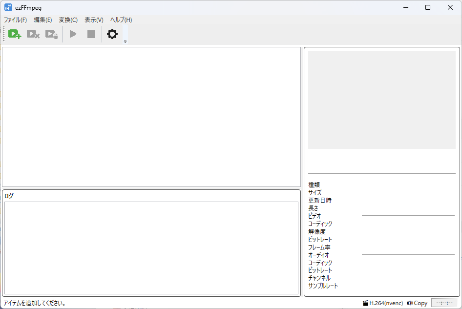
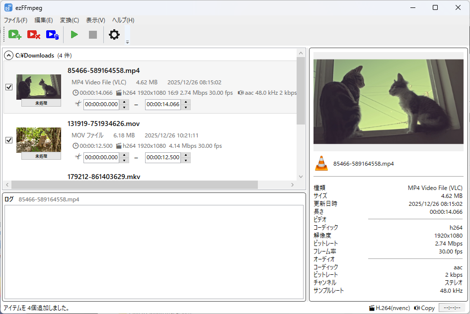
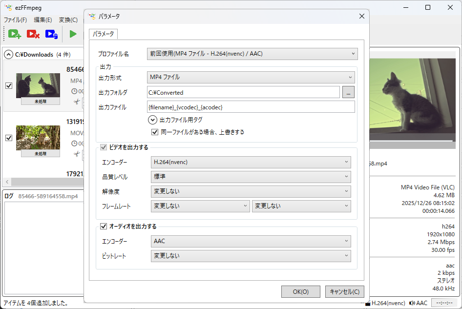

# ezFFmpeg
<<<<<<< HEAD

ezFFmpeg は、FFmpeg を **簡単・安全に扱うための GUI ツール**です。  
複雑な FFmpeg コマンドを直接書かずに、エンコード設定・プロファイル管理・GPU 利用などを行えます。

---

## ✨特徴

- 🎥 FFmpeg コマンドを意識せずに動画・音声変換
- ⚙ コーデック / エンコーダをモデル化して安全に選択
- 🚀 GPU エンコード（NVENC / QSV / AMF など）対応
- 📦 プロファイル管理による再利用性
- 🧩 C# (.NET) 向け設計

---

## 動作環境

- Windows11
- .NET 10
- FFmpeg（別途インストールが必要）

⚠️ **FFmpeg 本体は同梱していません。ユーザー自身でインストールしてください。**

---

## 🚀インストール

### 1.FFmpeg の準備

1. FFmpeg を公式サイトからダウンロード  
2. `FFmpeg` インストールフォルダに PATH を通す、または ezFFmpeg から参照可能な場所に配置

### 2. ezFFmpeg のインストール

- 以下の GitHub Releases ページから最新版をダウンロード  
  👉 https://github.com/ichiriki-sha/ezFFmpeg/releases/

  ※ 現在は **コンパイル済みバイナリ（Windows 用）** を提供しています  
  ※ ソースコードからビルドすることも可能です

- ソースからビルドする場合  
  `src/ezFFmpeg.slnx` を Visual Studio で開いてビルドしてください

---

## 📸 デモ

- メイン画面


- メイン画面(動画追加)


- パラメータ画面


---

## ❗ できること / できないこと

### できること

- 動画 / 音声のエンコード・変換
- 出力フォーマットに応じたエンコーダ制御
- GPU / CPU の自動・手動切り替え
- FFmpeg コマンド生成

### できないこと

- FFmpeg 自体のインストール・管理
- 非対応コーデックの強制使用
- すべての FFmpeg オプションの網羅

---

## 📁ディレクトリ構成

```Text
ezFFmpeg/
├─ src/
│  └─ ezFFmpeg/        # メインプロジェクト
│     ├─ Models/       # コーデック・設定モデル
│     ├─ Services/     # FFmpeg 実行・変換処理
│     ├─ ViewModels/   # MVVM ViewModel
│     └─ View/         # UI (XAML)
├─ assets/              # スクリーンショット
├─ docs/                # ドキュメント
└─ README.md
```
※ 詳細な構成は src/ 以下を参照してください。

## 📄 ドキュメント

詳細な設計方針や使い方については、以下のドキュメントを参照してください。

- [Overview](docs/overview.md)  
  プロジェクト全体の概要と目的

- [Architecture](docs/architecture.md)  
  内部構造・責務分離・設計方針

- [FFmpeg Options](docs/ffmpeg-options.md)  
  FFmpeg オプション設計と引数生成ルール

- [Profiles](docs/profiles.md)  
  エンコード設定（Profile）の考え方と管理方法

- [FAQ](docs/faq.md)  
  よくある質問とトラブルシューティング
=======
ezFFmpeg は、FFmpeg を 簡単・安全に扱うための GUI ツールです。
